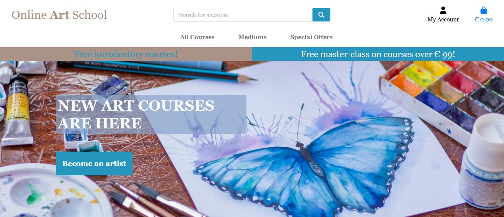
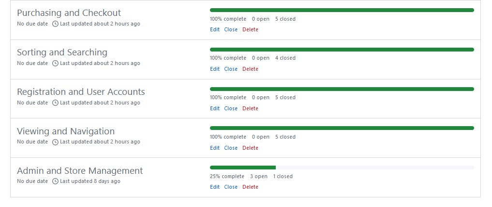
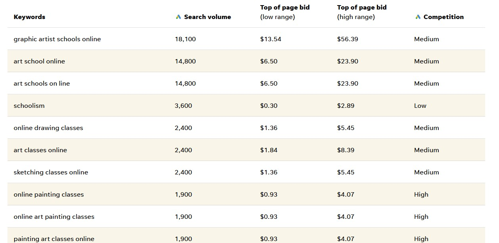
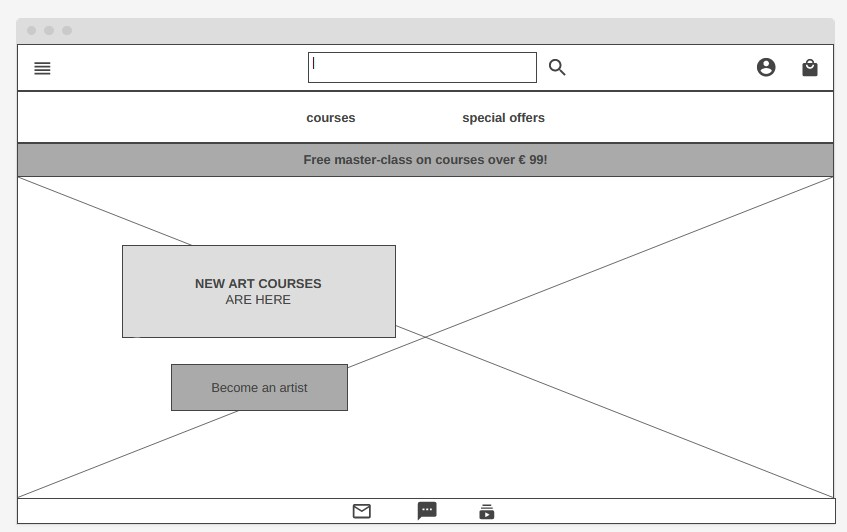
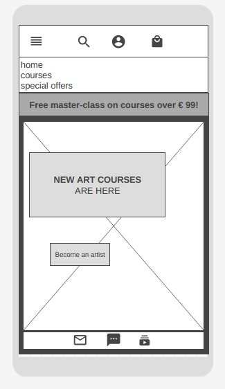
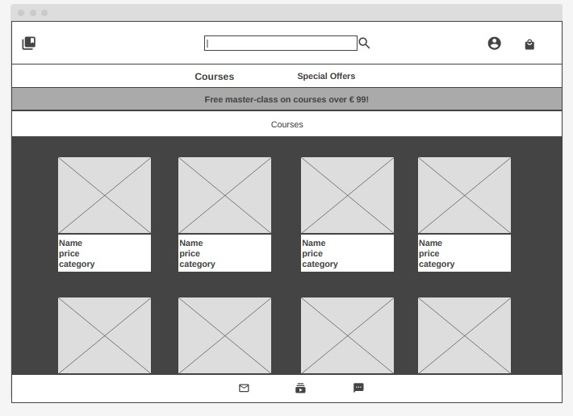
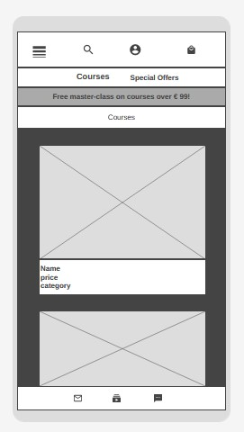
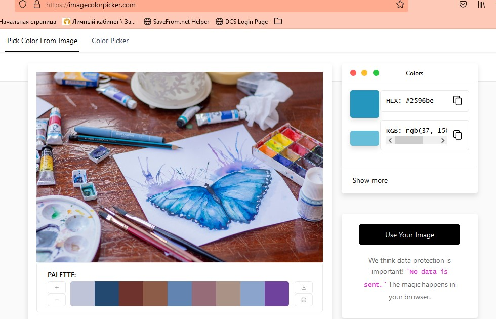

# Online Art School

This is an online art school where users can find courses to learn how to paint. They can browse for the courses they are interested in and/or try free ones.

<a href="https://art-school-b21a3c0ad1c4.herokuapp.com/" target="_blank">Link to the deployed project</a>

There were 5 milestones for user stories:

## SEO
Search Engine Optimization was implemented in several ways:

### Keywords
There was a research conducted to find the best keywords using Wordstream (https://www.wordstream.com/keywords). 

* The keywords were added to the meta tag in the head of the base template of the app.
* Also they were added to the content of the app, changed the h1 element from "New art courses are here" to "Online art courses to learn to paint are here" to include more keywords.

### Links

A rel attribute "noopener" was added to the social media links in the footer to tell search engines not to include them because they do not give any valuable information.

### Helpful files
There were 2 files created and added to the root of the app:
* sitemap.xml
* robots.txt

## Design

### Structure 

The following wireframes were created for the app. 

Desktop version of the home page:

Mobile version:

Desktop version of the courses page:

Mobile version:

### Colour-Scheme

The main color scheme of the web app is blue (#2596be). Firstly there was the main image selected and then colours were extracted from it using Image Color Picker (https://imagecolorpicker.com/)

### Typography

The Georgia font is used throughout the site. 

### Imagery

The images were taken from Unsplash and Freepic which are royalty free image sites.

## Technologies

* HTML - templates with HTML as the main language.

* CSS & Bootstrap - styled using an external CSS file and Bootstrap framework.

* JavaScript - to set timeout for message alerts and redirect if cancel.

* Gitpod - The app was developed using Gitpod IDE 

* GitHub - The source code is hosted on GitHub

* Git - Used to commit and push code during the development of the web app

* Font Awesome - icons throughout the site

* Favicon 

* Python - the main programming language using the Django Framework.

* Image Color Picker (https://imagecolorpicker.com/) - colour design

* Simemaps.com - a site map

* Wordstream.com - keywords search

## Credits

Code Institute for student template

Code Institute for Boutique Ado tutorial 

Unsplash and Freepic websites for royalty free images

