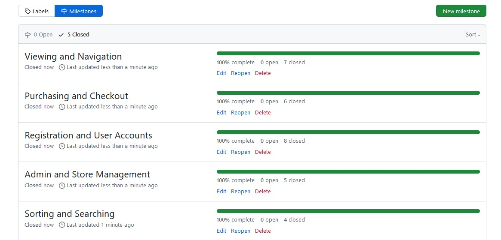
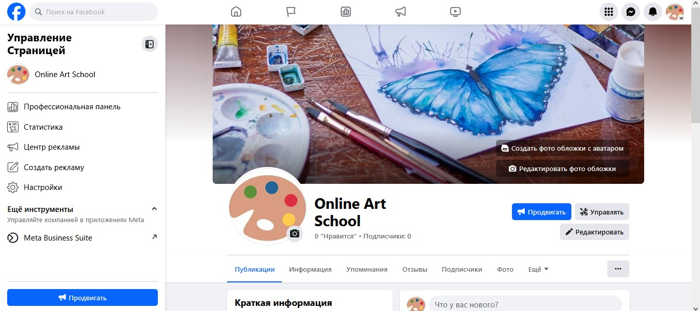

# Online Art School

This is an online art school where users can find courses to learn how to paint. They can browse for the courses they are interested in and/or try free ones. 

<a href="https://art-school-b21a3c0ad1c4.herokuapp.com/" target="_blank">Link to the deployed project</a>

This app is created for an e-commerce B2C business model. The content focuses on individual users. Its goal is to sell art courses.

## User-Experience-Design
### The-Strategy-Plane
#### App Goals

For admin: Manage the menu of courses displayed on the website, keep track of upcoming orders, edit, and delete if necessary, view user comments, approve them to be published on the site or delete.

For users: View, choose and buy courses, leave comments and subscribe to a newsletter in a simple way. 

#### Agile Planning

This project was developed using agile methodology by delivering small features in incremental sprints. The user stories were assigned to epics, prioritized under the labels: Must have, should have, could have. "Must have" stories were completed first to ensure that core features were completed to make the project ready to use.

There was created a Kanban board using GitHub projects. It can be found here: 
<a href="https://github.com/users/Natalitta/projects/8" target="_blank">Link to the project project</a>

There were 5 milestones for user stories:

## The-Scope-Plane

* Home page with a button to browse courses
* Drop-down navigation menu for mobile devices
* Restricted role based features
* Ability to perform CRUD functionality on courses for admin
* Responsive Design - Site should be fully functional on all devices from 320px up

## The-Structure-Plane
### Web Marketing strategies
This is an e-commerce B2C business model tat's why the content focuses on individual users.
Content marketing, social media and emails will work well for this type of e-commerce business model.
The following strategies were implemented:

### Social Media Marketing
A Facebook page was created to get attention through the use of social media.
Social media links are listed in the footer.

### Email Marketing
A functionality to subscribe for a newsletter was implemented to get attention through email.
A form to subscribe is located in the footer. It is implemented with the help of Mailchimp.

### SEO
Search Engine Optimization was implemented in several ways:

#### Keywords
There was a research conducted to find the best keywords using Wordstream (https://www.wordstream.com/keywords). 

* The keywords were added to the meta tag in the head of the base template of the app.
* Also they were added to the content of the app, changed the h1 element from "New art courses are here" to "Online art courses to learn to paint are here" to include more keywords.

#### Links

A rel attribute "noopener" was added to the social media links in the footer to tell search engines not to include them because they do not give any valuable information.

#### Helpful files
There were 2 files created and added to the root of the app:
* sitemap.xml
* robots.txt

## The-Structure-Plane
### Navigation Menu
The Navigation contains links for:

Home, Courses, Special Offers, Help, a search bar and My Account.

The following navigation items are available on all pages:

• Home -> index.html - Visible to all

• Login -> login.html - Visible to logged out users

• Register -> signup.html - Visible to logged out users

• Logout -> logout.html - Visible to logged in users

• Courses -> courses.html - Visible to all

• My account -> profile.html – Visible to logged in users

• Help -> contact.html – Visible to logged in users

The navigation menu is the same for all pages and displayed fully on big screens and drops down as a hamburger menu on smaller devices. It makes web application comfortably viewable on any device without taking up too much space on mobile devices.

### The-Skeleton-Plane
The following wireframes were created for the app. 
As it is an art school, images play a crucial role so the home page represents a painting the users can paint themselves if they become students of this school. 

Desktop version of the home page:

Mobile version:

Courses pictures are hugely important for the users to choose a course, that's why they are big.
Desktop version of the courses page:

Mobile version has only one courses displayed in a row allowing users to see the picture clearly:

A page with course details was planned to look the following way:

### Security
Views were secured by using the django login required decorator. An admin restricted functionality, was secured using if user is a superuser. 

All forms are protected with csrf tokens.

Environment variables were stored in variables for security purposes to ensure no secret keys, api keys or sensitive information is not available to anyone. These variables were added to the heroku config vars within the project in production.

### Error Pages
#### 404 Page

A 404 page has been implemented to display a custom Error page if a user navigates to a broken link.

The 404 page will allow the user to easily navigate back to the main website if they direct to a broken link / missing page, without the need of the browsers back button.

### Design
### Colour-Scheme

The main color scheme of the web app is blue (#2596be). Firstly there was the main image selected and then colours were extracted from it using Image Color Picker (https://imagecolorpicker.com/) to match the main image because.

### Typography

The Georgia font is used throughout the site. 

### Imagery

The images were taken from Unsplash and Freepic which are royalty free image sites.

## Technologies

* HTML - templates with HTML as the main language.

* CSS & Bootstrap - styled using an external CSS file and Bootstrap framework.

* JavaScript - to set timeout for message alerts and redirect if cancel.

* Gitpod - The app was developed using Gitpod IDE 

* GitHub - The source code is hosted on GitHub

* Git - Used to commit and push code during the development of the web app

* Font Awesome - icons throughout the site

* Favicon 

* Python - the main programming language using the Django Framework.

* Image Color Picker (https://imagecolorpicker.com/) - colour design

* Sitemaps.com - a site map

* Wordstream.com - keywords search

* Mailchimp - email newsletter

##  Testing
Test cases and results are store in a separate file due to the size of the file. They can be found in <a href="TESTING.md" target="_blank">TESTING.md file</a>.

## Deployment
### Version Control
The site was created using Gitpod and pushed to Github to the remote repository.

The following git commands were used throughout development to push code to the remote repo:

git add . - This command was used to add all files to the staging area before they are committed.

git commit -m “commit message” - This command was used to commit changes to the local repository prepare for the final step.

git push - This command was used to push all committed code to Github remote repository.

### Heroku Deployment
The site was deployed to Heroku. The deployment steps are:

1. Go to Heroku and create a new app clicking "New".
2. Choose a name and region for an app, click "Create app".
3. Go to "Settings" and navigate to Config Vars. Add the following config variables:
    
    SECRET_KEY: (Your secret key)
    DATABASE_URL: (This should already exist with add on of postgres)
    EMAIL_HOST_USER: (email address)
    EMAIL_HOST_PASS: (email app password)
    CLOUNDINARY_URL: (cloudinary api url)

4. Open "Deploy" tab. Select Github as the deployment method, authorize and search for repository by its name and connect.
5. Choose Enable Automatic Deploys, main branch.
6. Click Deploy a GitHub branch (main).
7. The app was successfully deployed. Click View to see it.

The live link can be found here: <a href="https://art-school-b21a3c0ad1c4.herokuapp.com/" target="_blank">Link to the deployed project</a>

## Credits

Code Institute for student template

Code Institute for Boutique Ado tutorial 

Unsplash and Freepic websites for royalty free images

