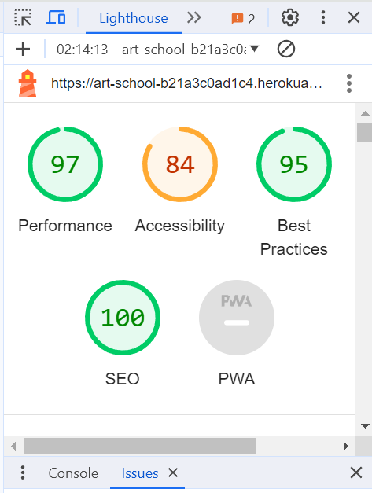

# Testing

### Lighthouse Testing

### Responsiveness
All pages were tested to ensure responsiveness on screen sizes from 320px and upwards as defined in WCAG 2.1 Reflow criteria for responsive design on Chrome, Edge, Firefox and Opera browsers.

Testing Steps:

Open browser and navigate to the app
Open the developer tools (right click and select "inspect")
Set to responsive and decrease width to 320px
Click and drag the responsive window to maximum width

Expected: Website is responsive on all screen sizes and no images are pixelated or stretched. No horizontal scroll is present. No elements overlap.

Actual Result: As Expected

Result: Pass

Website was also tested for the following devices and no responsive issues were seen:

Pixel 4A, Samsung Galaxy A51/71, iPhone Pro Max 14

### Functional Testing

#### Authentication
Description: Ensure a user can sign up to the website
Steps:

    Navigate to My account icon and click Register in the dropdown
    Enter email, username and password
    Click Sign up
Expected: Registration is successful, a user will get an email to continue the registration.

Actual: As expected

Result: Pass

Description: Ensure a user can log in once signed up
Steps:

    Navigate to the My account icon and click Login in the dropdown
    Enter login details from previous test case
    Click login
Expected: User is logged in successfully and can view My profile page which is restricted with their orders and can leave comments on courses.

Actual: As expected

Result: Pass

Description: Ensure a user can sign out
Steps:

    Login to the website, navigate to My account icon 
    Click the logout button in the dropdown
    Click confirm on the logout confirmation page
Expected: User is logged out successfully

Actual: As expected

Result: Pass

### Subscribtion Forms

Description: Ensure a form accepts only an email, submits and confirms to the user.
Steps:

    Navigate to the footer
    Enter an email
    Click Subscribe
Expected: Form successfully submits and a success message is displayed. Mailchimp receives the email.

Actual: As expected

Result: Pass

### Courses 
Description: Ensure an admin have access to create course items

Expected: A new course item is sucessfully added and can be viewed on home page.

Actual: As expected

Result: Pass

Description: Ensure a course can be updated

Expected: Menu item has been updated and new info is displayed on the home page.

Actual: As expected

Result: Pass

Description: Ensure a course item can be deleted
Steps:

    Add /admin to the website url
    Login using admin details
    Navigate to Courses 
    Click on the button Delete next to course to be deleted

Expected: Course item has been deleted and cannot be seen on the home page

Actual: As expected

Result: Pass

### Navigation Links
Testing was performed to ensure all navigation links on the respective pages, navigated to the correct pages as per design. This was done by clicking on the navigation links on each page.

Home -> index.html
Login -> login.html
Register -> signup.html
Logout -> logout.html
All Courses -> courses.html
My profile -> profile.html
All navigation links directed to the corect pages as expected.

### Footer link
Testing was performed on the footer link by clicking the font awesome icon and ensuring that the  facebook icon or text opened the website in new tab. 

Actual: As expected

Result: Pass

### Negative Testing
Tests were performed on the forms to ensure that:

A customer cannot use anything except an email.
A customer cannot edit or delete a course if not an admin.
Forms cannot be submitted when required fields are empty.

### Bugs
There was a bug with using classes for buttons and tags due to Bootstrap, some of them do not work unless changed into ids, I tried to specify them more precisely mentioning there parent element but it didn't work either.