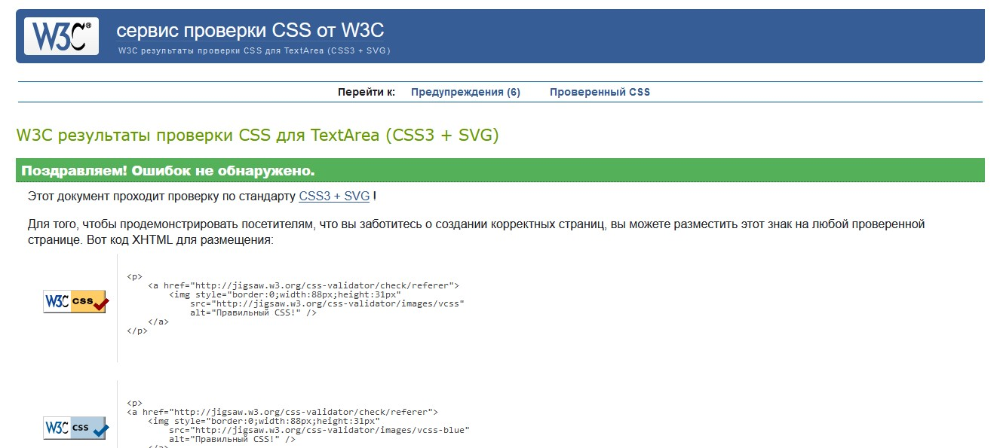

# Testing

## Validator Testing

### HTML

The pages were run through the w3 HTML Validator. There were some errors because of script type, some unclosed elements. All of these issues were corrected and all pages passed validation.

Due to django to test the validation on the files, open the page to validate, right click and view page source. Paste this html code into the validator.

### CSS

The pages were run through the w3 CSS Validator. CSS code passed validation.

### Java Script

The javascript code passed validation.

### Python

The python code passed validation through Python Linter. There are issues with too long lines, blank spacing or lack of spacing around operators, and 1 line instead of 2 expected. They were resolved and code passed through the validator with the exception of a few long lines.

## Lighthouse Testing

## Responsiveness
All pages were tested to ensure responsiveness on screen sizes from 320px and upwards as defined in WCAG 2.1 Reflow criteria for responsive design on Chrome, Edge, Firefox and Opera browsers.

Testing Steps:

1) Open browser and navigate to the app
2) Open the developer tools (right click and select "inspect")
3) Set to responsive and decrease width to 320px
4) Click and drag the responsive window to maximum width

Expected: Website is responsive on all screen sizes and no images are pixelated or stretched. No horizontal scroll is present. No elements overlap.

Actual Result: As Expected

Result: Pass

Website was also tested for the following devices and no responsive issues were seen:

Pixel 7, Samsung Galaxy A51/71, iPhone Pro Max 14

## Functional Testing

### Authentication
#### Description: Ensure a user can sign up to the website
Steps:

1) Navigate to My account icon and click Register in the dropdown
2) Enter email, username and password
3) Click Sign up
Expected: Registration is successful, a user will get an email to continue the registration.

Actual: As expected

Result: Pass

#### Description: Ensure a user can log in once signed up
Steps:

1) Navigate to the My account icon and click Login in the dropdown
2) Enter login details from previous test case
3) Click login
Expected: User is logged in successfully and can view My profile page which is restricted with their orders and can leave comments on courses.

Actual: As expected

Result: Pass

#### Description: Ensure a user can sign out
Steps:

1) Login to the website, navigate to My account icon 
2) Click the logout button in the dropdown
3) Click confirm on the logout confirmation page

Expected: User is logged out successfully

Actual: As expected

Result: Pass

### Subscribtion Forms

#### Description: Ensure a form accepts only an email, submits and confirms to the user.
Steps:

1) Navigate to the footer
2) Enter an email
3) Click Subscribe

Expected: Form successfully submits and a success message is displayed. Mailchimp receives the email.

Actual: As expected

Result: Pass

### Courses 
#### Description: Ensure an admin have access to create course items

Expected: A new course item is sucessfully added and can be viewed on home page.

Actual: As expected

Result: Pass

#### Description: Ensure a course can be updated

Expected: An updating form is displayed and an alert message.

Actual: As expected and a helpful message displayed.

Result: Pass

Expected: Menu item has been updated and new info is displayed on the home page.

Actual: As expected and a helpful message displayed.

Result: Pass

#### Description: Ensure a course item can be deleted
Steps:

1) Add /admin to the website url
2) Login using admin details
3) Navigate to Courses 
4) Click on the button Delete next to course to be deleted

Expected: Course item has been deleted and cannot be seen on the home page

Actual: As expected

Result: Pass

### Comments

#### Description: Ensure approved comments are displayed

Expected: Comments are displayed.

Actual: As expected.

Result: Pass

#### Description: Ensure comments can contain images

Expected: Images in comments are displayed if exist.

Actual: As expected.

Result: Pass

#### Description: Ensure comments can be submitted

Expected: Comments submit.

Actual: As expected.

Result: Pass

### Purchase

#### Description: Ensure orders are submitted and a helpful message displayed.

Expected: Order created a message is displayed.

Actual: As expected.

Result: Pass

#### Description: Ensure email sent with an access link after purchase.

Expected: Email received, link works.

Actual: As expected.

Result: Pass

### Payments

#### Description: Ensure payments are processed

Expected: Stripe gets payments.

Actual: As expected.

Result: Pass

### Navigation Links
Testing was performed to ensure all navigation links on the respective pages, navigated to the correct pages as per design. This was done by clicking on the navigation links on each page.

* Home -> index.html
* Login -> login.html
* Register -> signup.html
* Logout -> logout.html
* All Courses -> courses.html
* My profile -> profile.html
* Management -> add_course.html
* My wishlist -> wishlist.html

All navigation links directed to the corect pages as expected.

### Footer link
Testing was performed on the footer link by clicking the font awesome icon and ensuring that the  facebook icon or text opened the website in new tab. 

Actual: As expected

Result: Pass

### Negative Testing
Tests were performed on the forms to ensure that:

A customer cannot use anything except an email.

A customer cannot edit or delete a course if not an admin.

Forms cannot be submitted when required fields are empty.

### Bugs
There was a bug with using classes for buttons and tags due to Bootstrap, some of them do not work unless changed into ids, I tried to specify them more precisely mentioning their parent element but it didn't work either.

After creating a new model Comments, it was working in local environment but in the deployed to heroku it didn’t display the course detail page saying that the comment doesn’t exist in the database. I solved this issue by logining into heroku cli and migrate there too.
